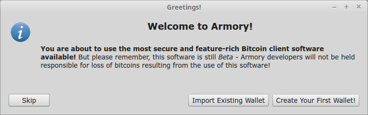
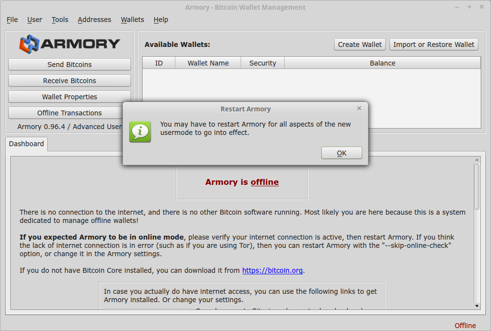
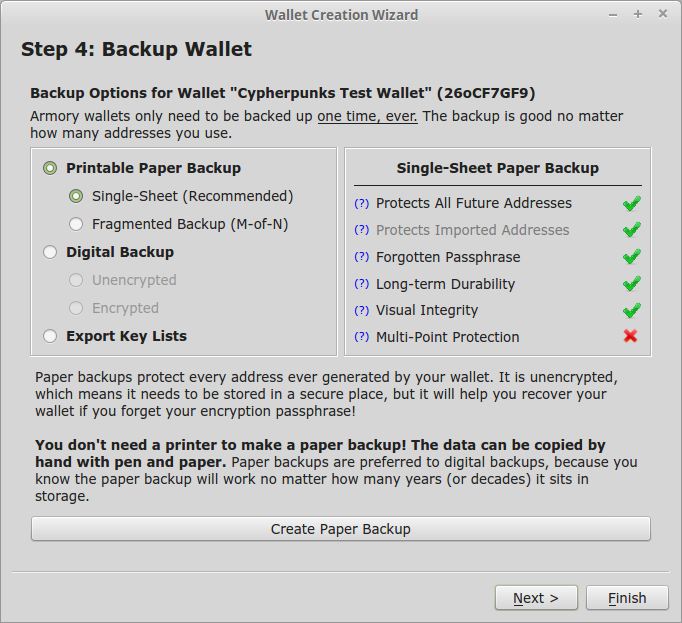
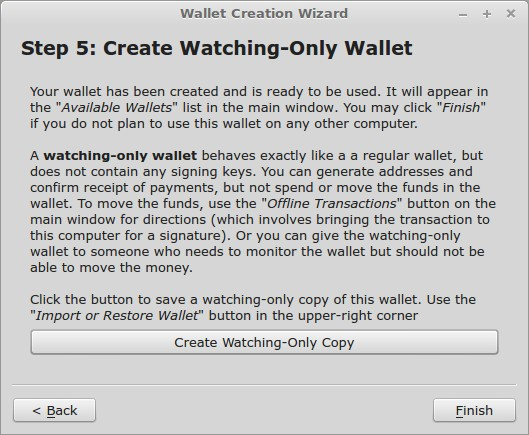
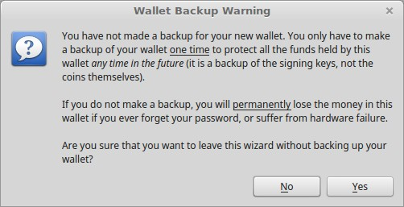
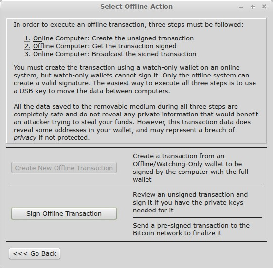
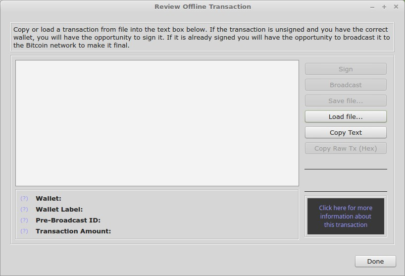

# Transações offline com Armory
***

O Armory é open source e atualmente seu desenvolvimento é feito pela comunidade. Ela é uma das carteiras de bitcoin mais seguras. Sua grande vantagem está na possibilidade de criar e deixar suas chaves privadas em um PC offline, reduzindo drasticamente vetores de ataque. Essa é a chamada cold storage ou armazenamento a frio.

O funcionamento é bem simples. A carteira que fica online inicia mas não consegue completar uma transação. Para isso ela tem que ter autorização da carteira offline. Assim se um atacante conseguir acesso a sua carteira (a que fica sempre online, claro) não vai conseguir fazer nenhuma transação, pois precisa da autorização da carteira que fica em outro computador (a que fica offline).
As autorizações das transações ocorrem através de arquivos entre o computador offline e o online. Arquivos que podem ser transferidos com o uso de pendrive, CD, DVD etc.

Essa forma de transação é mais demorada, sendo indicada para carteiras que guardam grandes valores e necessitam maior cuidado com a segurança. Se você faz transações de pequenas quantidades com maior frequência, use uma carteira online como a Exodus por exemplo.

Nesse tutorial vamos usar o Linux para a carteira offline e a Omniwallet para online.
Assim não precisamos baixar a blockchain no computador. Teremos uma redução de privacidade por usar a Omni, mas como todas as transações são públicas creio que isso não seja um grande problema.

Podemos fazer o download e a instalação com o computador que ficará offline conectado, mas logo que terminarmos a instalação esse PC nunca mais deve entrar em contato com a rede. Você pode baixar o instalador em uma máquina e transferir o arquivo para o offline como opção.

## I - Download, verificação do instalador e instalação

Não usaremos o [site oficial] para baixar o instalador e sim o [repositório do GitHub] da carteira por conter todos os arquivos necessários e atualizados.
Baixe a versão mais recente do instalador compatível com seu sistema operacional juntamente com a chave pública do desenvolvedor e o hash nos links abaixo:

* Windows [instalador] ou [portátil] / Linux [GCC4.7] ou [GCC7.2]
* [Hash]
* [Chave pública]

Após o download de todos os arquivos precisaremos importar a chave pública do desenvolvedor para o gerenciador de chaves com o comando:
```
gpg –import goatpig-signing-key.asc
```

Logo após isso, verificaremos o arquivo de hash com:
```
gpg –verify sha256sum.asc
```
Isso é importante para ter certeza da autenticidade da origem do arquivo (se foi assinado pelo desenvolvedor), além de verificar se não está corrompido.


Agora precisamos verificar o hash do instalador. Digite no terminal:
```
sha256sum armory_0.96.4_amd64_gcc4.7_noasm.deb
```

Copie o hash que aparece e, então, abra o sha256sum.asc com um editor de texto e confira o hash do instalador que baixou. Para verificar se os hashes correspondem não olhe caractere por caractere, abra a função de localização e cole o hash que você copiou do terminal. O resultado deve ser igual ao hash da mensagem assinada.


Uma forma de verificar o arquivo rapidamente é digitando:
```
sha256sum -c sha256sum.asc armory_0.96.4_amd64_gcc7.2.deb 
```

Isto irá gerar uma saída em que a linha que nos interessa contém:
```
armory_0.96.4_amd64_gcc7.2.deb: SUCESSO
```

Com tudo verificado podemos instalar.


Os pacotes extras serão instalados automaticamente.

## II - Configuração e criação da carteira

Antes de abrir o programa pela primeira vez é importante desconectar o computador. Se você baixou o instalador a partir de outro computador, melhor ainda, podemos seguir normalmente.

**Atenção**
A partir de agora seu PC offline nunca mais deve entrar em contato com a internet para garantir a melhor segurança de sua carteira. Dessa forma um atacante só vai conseguir acesso ao seu computador se estiver frente a ele fisicamente.

Abra o Armory e, após aceitar os termos, vamos criar nossa carteira offline.


Por enquanto vamos clicar em skip.



Clique em User e selecione Expert.



Feche o programa e abra novamente.

Quando aparecer a pergunta se quer usar o Armory como programa padrão de bitcoin pode aceitar. Nesse computador offline nenhum outro programa deve estar instalado, portanto isso não importa muito.


Agora vamos em Create Your First Wallet.

[](img/armory-08.png)

Selecione Add Manual Entropy.


Escolha cartas aleatoriamente até gerar pelo menos 192 bits de entropia (quanto maior a entropia melhor), depois clique em Next.

Agora crie uma senha boa para sua carteira. 
Essa senha vai te proteger caso alguém tenha acesso físico ao seu computador. 


Depois de repetir a senha vamos criar o backup em papel.


Essa é a etapa mais importante!
Vamos usar a opção Single-Sheet, que protege a carteira mesmo que a senha do passo anterior seja perdida.



Anote com atenção sua Root Key, Wallet Version e Wallet ID. Faça algumas cópias e guarde em locais seguros.


**Atenção**
Qualquer pessoa que conseguir acesso a esse backup em papel terá acesso ao seus Bitcoins!
**Não tire nenhuma foto do QR code!**

Depois de copiar essas informações em papel e conferir tudo feche essa janela e clique em Test Backup.


Se tudo estiver correto veremos a seguinte mensagem.


Feche a janela. E de volta ao Step 4 clique em next.

Agora podemos criar uma Watching-Only Wallet, essa é a wallet que ficará no PC online para monitorar e iniciar transações.
Nesse tutorial vamos usar a Omni para isso, mas caso tenha interesse em baixar a blockchain e usar a parte online do Armory você pode criar essa Watching-Only Wallet. Basta salvar o arquivo e enviar para o PC online.



Feche essa janela e o Wallet Creation Wizard.

Como o backup já foi feito em papel pode clicar em Yes.



Pronto!
Essa é uma carteira determinística, então todos os endereços gerados estão protegidos no backup em papel. Uma carteira determinística (HD Wallet) é capaz de gerar sempre um novo endereço público para cada transação de envio ou recebimento, com a praticidade de se poder acessá-los com a mesma chave.

# Omniwallet e Armory
Vamos usar a **Omniwallet** para iniciar as transações dessa forma não precisamos baixar toda a blockchain do bitcoin.  A desvantagem é que cada chave publica deve ser importada manualmente.

## III - Exportar a chave pública

Abra o Armory no PC offline e clique em Lockboxes.


Select Publick Key.


Escolha um endereço.


Clique em Select Address.


Copie a chave pública para um arquivo de texto e transfira para o PC online.


Agora entre na sua conta da Omniwallet. Vá em My Addresses – Add Addresses – Add Armory Offline Address.


Cole a chave pública que foi salva no arquivo de texto e clique Add Address.

Esse ícone mostra que a chave privada está offline.


## IV - Enviar moedas da carteira offline

Quando você selecionar um endereço offline para enviar bitcoins você terá que salvar uma **transação não assinada** em um arquivo de texto, que é um pedido de assinatura para a chave privada. Basta salvar o arquivo e enviar para o PC offline.


Com o arquivo no PC Offline clique em Offline Transactions e depois Sign Offline Transaction.



Clique em Load File, carregue a transação não assinada e clique em Sign.



Depois escolha Broadcast e salve a transação assinada em um outro arquivo de texto. Após isso, envie o arquivo para o PC online.

De volta a Omniwallet vá em ```My Addresses –> Actions –> Broadcast Transaction```.


Cole o texto assinado e clique em Broadcast.


**Se todos os passos foram seguidos corretamente seus bitcoins foram enviados e em nenhum momento a chave privada foi exposta a rede.**

[site oficial]: https://www.bitcoinarmory.com
[repositório do GitHub]: https://github.com/goatpig/BitcoinArmory/
[instalador]: https://github.com/goatpig/BitcoinArmory/releases/download/v0.96.4/armory_0.96.4-win64.exe
[portátil]: https://github.com/goatpig/BitcoinArmory/releases/download/v0.96.4/armory_0.96.4-win64.zip
[GCC4.7]: https://github.com/goatpig/BitcoinArmory/releases/download/v0.96.4/armory_0.96.4_amd64_gcc4.7_noasm.deb
[GCC7.2]: https://github.com/goatpig/BitcoinArmory/releases/download/v0.96.4/armory_0.96.4_amd64_gcc7.2.deb
[Hash]: https://github.com/goatpig/BitcoinArmory/releases/download/v0.96.4/sha256sum.asc
[Chave pública]: https://github.com/goatpig/BitcoinArmory/blob/master/PublicKeys/goatpig-signing-key.asc
