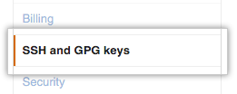
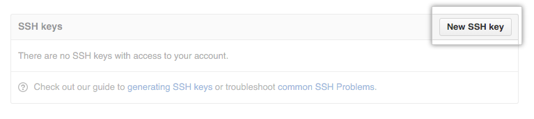
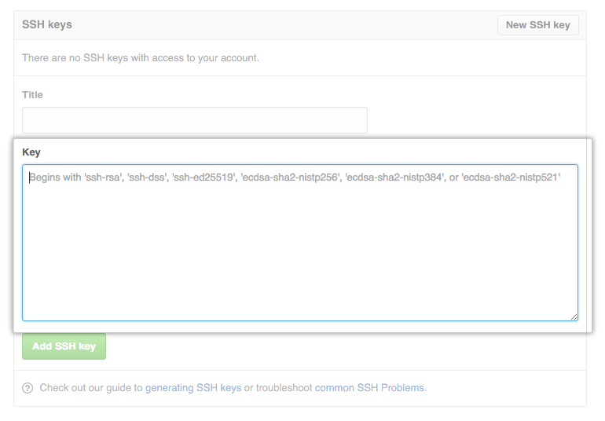

# Git
***

[Se você não sabe ou não está acostumado a usar o **Git**, pule para o passo a passo detalhado](#passo-a-passo-detalhado)

## Passo a passo simplificado

## I - Local

###### 1. Informe ao _Git_ os dados que identificarão seus _commits_
```
git config --global user.name "Nome Sobrenome"
git config --global user.email "seu_email@email.com"
```

###### 2. Crie um par de chaves _SSH_
```
ssh-keygen -t rsa -b 4096 -C "seu_email@email.com"
```

###### 3. Dê _Enter_ para salvar o arquivo e escolha uma senha para essa chave
```
Enter passphrase (empty for no passphrase):
Enter same passphrase again:
```

###### 4. Adicione a chave privada ao _ssh-agent_
```
eval $(ssh-agent -s)
ssh-add ~/.ssh/id_rsa
```

## II - GitHub

###### 1. Copie o conteúdo da chave pública do _SSH_.

###### 2.  No canto superior direito da página, clique na foto do seu perfil e, em seguida, clique em _Settings_.

###### 3. Na barra lateral de configurações do usuário, clique em _SSH and GPG keys_.

###### 4. Clique em _New SSH key_ ou _Add SSH key_.

###### 5. No campo _Title_, adicione um rótulo.

###### 6. Cole sua chave no campo _Key_.

###### 7. Clique em _Add SSH key_.

###### 8. Se solicitado, confirme sua senha do GitHub.

##### Ao fim dessa configuração você pode ir para o passo a passo usando [Git e GitHub] para enviar sua contribuição ou ir para a página de [contribuições].

## Passo a passo detalhado

## I - Configurando o Git localmente

Após a instalação do _Git_ no seu computador, vamos configurar seu dados. Informe ao _Git_ os dados que identificarão seus _commits_. Digite os comandos:

```
git config --global user.name "Nome Sobrenome"
git config --global user.email "seu_email@email.com"
```

Após isso você está pronto para usar o **Git** localmente.

Tendo cadastrado e logado em sua conta, agora você precisa de uma chave **SSH** para poder começar a _comitar_ para sua conta. No terminal digite:

```
ssh-keygen -t rsa -b 4096 -C "seu_email@email.com"
```

O comando ```-t rsa``` indica que o tipo de chave é **RSA**. O comando ```-b 4096``` indica que o tamanho da chave é de 4096 bits. Se quiser pode deixar sem o ```-b 4096```, criando uma chave padrão com tamanho 2048 bits. Enfim, o último comando ```-C "seu_email@dominio.com"``` indica sua conta do GitHub.

Após isso,aparecerá:
```
Generating public/private rsa key pair.
Enter file in which to save the key (/home/schacon/.ssh/id_rsa):
```
Nesse momento, dê _Enter_ para salvar a chave nesse arquivo mesmo.

Logo após, será exibido ```Created directory '/home/schacon/.ssh'```, indicando onde está salva a sua chave. Após isso, digite uma senha para a chave _SSH_, não precisa ser a mesma do _GitHub_. Se quiser pode deixá-la em branco para evitar digitá-la toda vez que for baixar algo de um repositório ou enviar algo para lá.
```
Enter passphrase (empty for no passphrase):
Enter same passphrase again:
```

Logo em seguida, vai ser mostrado a você o seguinte:
```
Your identification has been saved in /home/user/.ssh/id_rsa.
Your public key has been saved in /home/user/.ssh/id_rsa.pub.
The key fingerprint is:
d0:82:24:8e:d7:f1:bb:9b:33:53:96:93:49:da:9b:e3 seu_email@dominio.com
The key's randomart image is:
+---[RSA 4096]----+
|o= . ..          |
|+ + *  * o       |
|   O o= @        |
|    *. X . .     |
|   o .o S o      |
|    o.   oo.     |
|   .  o.=++.     |
|    E..*.=+      |
|     .+.B*       |
+----[SHA256]-----+
```

Caso você tenha colocado uma senha ao criar o par de chaves, você pode evitar digitar a senha toda vez que enviar ou baixar algo de algum repositório usando o **ssh-agent**. Este detecta a chave automaticamente. Para iniciá-lo digite:
```
eval $(ssh-agent -s)
```
Após isso, aparecerá para você ```Agent pid 59566```, indicando que o processo está em execução.

Adicione sua chave privada **SSH** ao **ssh-agent**. Se você criou sua chave com um nome diferente ou se estiver adicionando uma chave existente que tenha um nome diferente, substitua **id_rsa** no comando pelo nome do seu arquivo de chave privada. O comando é:
```
ssh-add ~/.ssh/id_rsa
```

## II - Adicionando a chave a sua conta GitHub

**1.** Copie a chave pública _SSH_ que se encontra no arquivo ```~/.ssh/id_rsa.pub```. Você pode usar o comando:
```
clip < ~/.ssh/id_rsa.pub
```
Ou simplesmente abrir esse arquivo com um editor de texto e copiar o conteúdo.

**2.** No canto superior direito da página, clique na foto do seu perfil e, em seguida, clique em **Settings**.


**3.** Na barra lateral de configurações do usuário, clique em **SSH and GPG keys**.



**4.** Clique em **New SSH key** ou **Add SSH key**.



**5.** No campo **Title**, adicione um rótulo descritivo para a nova chave. Por exemplo, se você estiver usando um Mac pessoal, poderá chamar essa chave de "Personal MacBook Air".

**6.** Cole sua chave no campo **Key**.



**7.** Clique em **Add SSH key**.


**8.** Se solicitado, confirme sua senha do **GitHub**.


[contribuições]: https://github.com/cypherpunksbr/cypherpunks.com.br/blob/master/CONTRIBUTING.md
[Git e GitHub]: https://github.com/cypherpunksbr/cypherpunks.com.br/blob/master/documentacao/GITGITHUB.md
