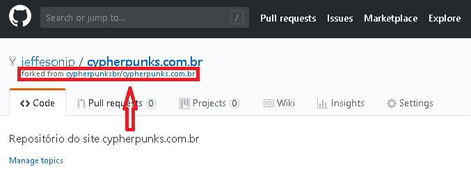
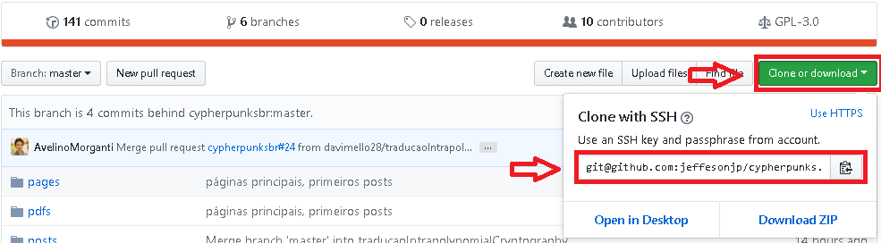
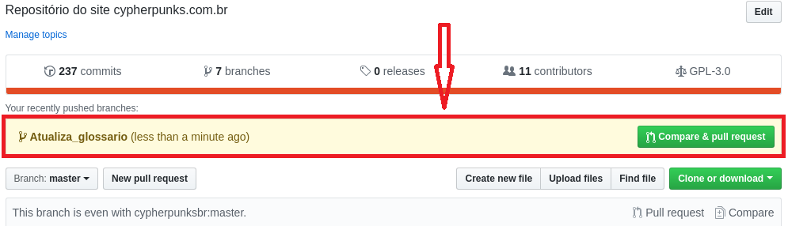
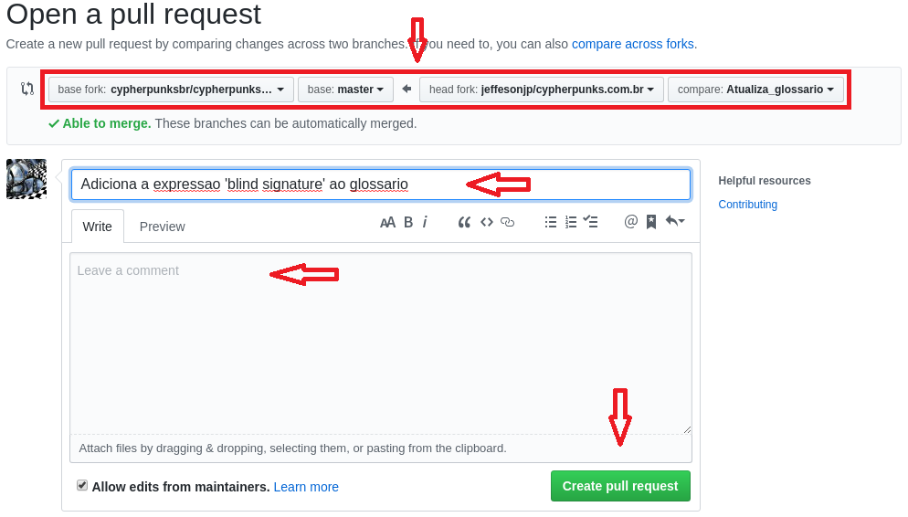
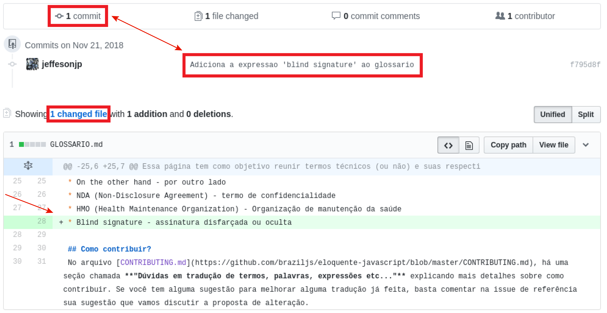
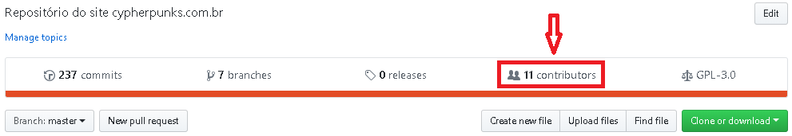
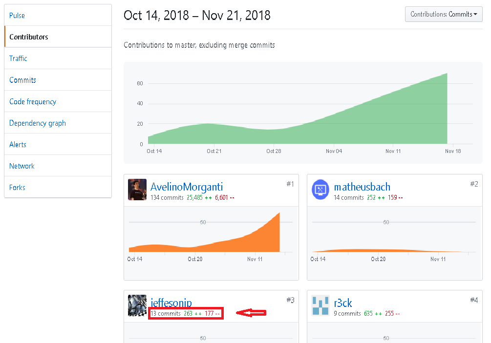

# Git e GitHub
***

#### Se você não sabe ou não está acostumado a usar essas ferramentas, pule para o [passo a passo detalhado](#passo-a-passo-detalhado)

#### Se você não configurou o _Git_ veja como fazer isso clicando [aqui].

## Passo a passo simplificado

###### 1. Após o _fork_ e o _clone_, referencie o repositório oficial
```
git remote add upstream git@github.com:cypherpunksbr/cypherpunks.com.br.git
```

###### 2. Crie uma _branch_ para fazer suas alterações (crie com um nome coerente com o que vai ser feito)
```
git checkout -b nome_da_branch
```

###### 3. Após as alterações, faça um _commit_ com uma mensagem coerente do que foi feito
```
git add --all
git commit -am "sua mensagem"
git push origin nome_da_branch
```

###### 4. Envie um _Pull Request_ com as alterações feitas. Sua contribuição será analisada pela comunidade. Em alguns casos pediremos algumas alterações antes de dar _merge_.

###### 5. Após o _merge_
###### * Delete a _branch_ utilizada
```
git checkout master
git push origin :nome_da_branch
git branch -D nome_da_branch
```
###### * Atualize seu repositório com o repositório oficial:
```
git fetch upstream
git rebase upstream/master
git push -f origin master
```

###### 6. Quando iniciar uma nova contribuição, inicie o processo pelo passo #2.


###### 7. Importante

- Antes de enviar sua contribuição, certifique-se de que está enviando apenas um **único** _commit_ que represente o que foi feito. Caso tenha feito vários commits, [esmague-os] antes de fazer o _Pull Request_.
- Caso tenha qualquer tipo de dúvida, abra uma [_Issue_] que faremos o possível para te ajudar.

#### Volte a página de [contribuições] e veja o restante das recomendações.

## Passo a passo detalhado

Atenção!  Antes de iniciar o passo a passo, leia toda a explicação até o fim e garanta que entendeu tudo o que tem que fazer.

## I - Forkando o repositório

A primeira coisa a fazer é _forkar_ o repositório. Acesse a página do repositório no **Github** e clique no botão _Fork_:


_O que significa forkar?_
A tradução literal de _fork_ é garfo. Então, você dá uma “garfada” no repositório, dá aquela enrolada no garfo e traz ele pra sua conta :laughing:

Quando você _forkar_ o repositório, repare que, abaixo do nome do repositório é mostrado o repositório original, ou seja, de onde ele foi _forkado_:



Você agora pode fazer o que quiser com esse repositório (tomando cuidado com a licença sob a qual ele foi liberado). A ideia aqui é resolver um problema e enviar o _pull request_ com a correção para o repositório original. Como você não tem permissão para commitar diretamente no repositório principal, você precisa _forkar_ e alterar no seu, para então submeter a correção.

Após _forkar_, vamos fazer nossas alterações!


## II - Clonando o repositório

Agora você precisa baixar os arquivos do repositório para que você possa alterar. A primeira coisa a fazer é copiar a URL do repositório daqui:


Confira se o texto destacado está como ```Clone with SSH```. Se não estiver, clique em ```Use SSH``` que aparece ao lado.

Após copiar a URL, abra seu terminal, crie um diretório onde você vai guardar o projeto e digite ```git clone <url-do-repositorio>```:

```
git clone git@github.com:jeffesonjp/cypherpunks.com.br.git
```

Neste momento você deve clonar o seu fork e não o repositório oficial.
O comando ```git clone``` pega o repositório como ele está no GitHub, já iniciado e com todo o histórico de commits atualizado. Seria o mesmo que você executar os comandos:

```
git init
git remote add origin git@github.com:jeffesonjp/cypherpunks.com.br.git
git pull origin master
```

Pronto! Já temos nosso projeto clonado em nossa máquina local! Com esse comando (```git clone```), será criado um diretório com o mesmo nome do repositório. Entrando nele (```cd cypherpunks.com.br```), vamos começar a modificar!


## III - Criando a branch para criar ou modificar algo

Agora vamos criar uma nova branch para a nossa tarefa. Digamos que vamos criar uma _feature_. Vamos criar uma _branch_ com um nome que diga o que será feito. Antes de tudo, garanta que você está na **branch master**, executando o comando:

```
git branch
```
A resposta deve ser:
```
* master
```

_Porque precisa estar na master?_
Por convenção, o _git_ utiliza a **branch master** como padrão, para o código estável do projeto. Então, tudo o que estiver nessa _branch_, em qualquer repositório, -- teóricamente -- é código estável. Logo, você nunca irá mexer diretamente nela, mas em outras _branchs_, para então fazer **merge** com a **master**.

Agora vamos criar a _branch_ com nossa modificação. Temos duas formas de fazer isso. A forma mais rápida é:
```
git checkout -b Atualiza_glossario
```
```Atualiza_glossario``` é o nome da nossa _branch_. A outra forma de criar uma _branch_ é com os comandos:
```
git branch Atualiza_glossario
git checkout Atualiza_glossario
```
O primeiro comando cria a _branch_. O segundo comando troca da _branch_ **master** para a _branch_ **Atualiza_glossario**

Mas o primeiro comando que executamos (```git checkout -b Atualiza_glossario```), já faz essas duas coisas em um comando só: cria a _branch_ (```-b```) e já muda para a _branch_ criada (```git checkout```).

_Tá, mas porque eu preciso criar uma nova branch? Se tudo irá para a master, porque não posso modificar direto ali?_
Como eu disse, a _branch_ **master** é a _branch_ com o código final do projeto, estável. Criando uma nova _branch_, se você submeter o _pull request_ para o repositório original, mas ele não for aceito, as alterações não estarão na sua **branch master**. Dessa forma, se você quiser manter sempre os dois repositórios atualizados e sincronizados, você só precisa apagar a branch que você criou e fez a _feature_. As duas **master** vão continuar iguaizinhas :smile:

**4.** Após fazer sua alteração, é hora de enviar para o seu _fork_. Primeiro você precisa _commitar_ sua alteração:
```
git add --all
git commit -am "Adiciona a expressão 'blind signature' ao glossario"
```

O _commit_ não precisa ser nada muito formal, mas escreva de uma forma que qualquer pessoa que ler, entenda.

## IV - Pull Request

Após _commitar_, nossa alteração já está na árvore do **git**. Vamos agora subir para o nosso repositório _forkado_:
```
git push origin Atualiza_glossario
```

Você vai rodar esse comando, trocando ```Atualiza_glossario``` pelo nome da sua **branch**, obviamente.

Fazendo isso, acesse a conta do repositório original no **Github**, e você verá uma mensagem como essa:


Depois é só clicar no botão verde **Compare & pull request**.

_O que é Pull Request?_
_Pull Request_ é quando você envia uma sugestão de melhoria para o repositório.

Quando você quer trazer, pegar, puxar algo para o seu repositório usando o **git**, você usa o comando ```git pull```. Então, um _pull request_ nada mais é do que uma requisição ou pedido para que aquele repositório faça um _pull_ com as suas alterações. :smile:

Após clicar no botão **Compare & pull request**, você será direcionado para a tela onde você vai criar o _pull request_ e pode conferir se as alterações que aparecem realmente correspondem às alterações que você fez:


Na imagem acima você pode ver:
* Onde diz **base fork** é o diretório padrão. No meu caso, está em **cypherpunksbr/cypherpunks.com.br**.
* Ao lado, a _branch_ para a qual eu vou enviar meu _pull request_. Vou enviar direto para a master do repositório padrão.
* **head fork** é o seu repositório, que você _forkou_. Na imagem, é o **jeffesonjp/cypherpunks.com.br**.
* E por fim, a **branch** onde eu fiz a alteração: _Atualiza_glossario_

Depois disso, você vai colocar um título no seu _pull request_, para que, ao visualizar a listagem de _pull requests_, fique fácil saber do que se trata. Normalmente, quando você só tem uma mensagem de _commit_, esse título é assumido com a mensagem. Ajuste conforme a necessidade.

Lembre-se de comentar porque você está fazendo esse **pull request** e porque faz sentido para o repositório. Uma boa defesa pode ajudar a fazer com que seu **pull request** seja aceito.

Antes de clicar no botão **Create pull request**, confira os dados da imagem abaixo:


Rolando um pouco, você vai ver os _commits_ que você fez. Confira se está na _branch_ correta, e que você está enviando somente aquilo que você alterou. Se você escolher uma **branch** errada para enviar, você verá milhares de outras alterações - ou talvez nenhuma, se for a mesma _branch_ - que não fará sentido de ser feito o **merge** do _pull request_.

No meu caso, eu fiz só uma alteração no **GLOSSARIO.md**, adicionando a expressão "Blind signature - assinatura disfarçada ou oculta".

Depois de tudo verificado, clique no botão **Creat pull request** e aguarde a resposta! Você será avisado por e-mail - se você não desabilitou as notificações - se houver qualquer atividade nesse _pull request_. Se a _branch_ for fechada, foi por que o autor achou que a alteração não fez sentido ou o **merge** foi feito.

Se ele fez o **merge**, então sua alteração já faz parte do repositório principal, e você aparecerá na guia **Contributors** do repositório principal:


Como você viu na imagem acima, aparece quantos _commits_ você fez, quanto código você adicionou e quanto você removeu!

## V - Modificações aprovadas

Caso o autor do repositório tenha aprovado sua **branch** e feito **merge**, siga os seguintes passos:
```
git checkout master
git push origin :Atualiza_glossario
git branch -D Atualiza_glossario
```
Como você bem se lembra, o primeiro comando (```git checkout master```) muda para a _branch master_. O segundo comando (```git push origin :Atualiza_glossario```) envia uma instrução para deletar a _branch_ **Atualiza_glossario** do repositório da sua conta do **GitHub**. Enfim, o terceiro comando deleta a _branch_ do seu repositório local.

_Mas por que eu deveria apagar minhas branchs, não seria mais fácil eu simplesmente dar **merge** no meu repositório local e no GitHub?_
Você pode fazer isso, mas se houver outros **commit** aprovados antes do seu, você terá que atualizar o repositório com o oficial depois da mesma forma. Estamos sugerindo apenas que você atualize tudo de uma vez :smile:

O próximo passo atualizará seu repositorio, tanto remoto quanto localmente.

## VI - Manter o projeto sempre atualizado

_Como atualizar seu repositório com o repositório oficial?_
O seu repositório _forkado_ normalmente é adicionado como **origin** quando você faz o **clone**. Para sincronizar com o repositório principal, adicione esse repositório com outro nome (no nosso caso, **upstream** que é o nome do meu remote, poderia ser outro nome).
```
git remote add upstream git@github.com:cypherpunksbr/cypherpunks.com.br.git
```
É importante que você execute este comando logo após clonar o repositório para sua máquina. Este serve para dizer ao seu repositório local qual é a origem do repositório e servirá para manter seu _fork_ atualizado de acordo com o repositório oficial. Se você apagar (por acidente, por exemplo)  seu repositório local e clonar de novo, execute o mesmo comando.

Após isso faça o seguinte:
```
git fetch upstream
git rebase upstream/master
git push -f origin master
```

O comando ```git fetch upstream``` pega os dados do repositório remoto que nomeamos como **upstream**, no nosso caso é o ```git@github.com:cypherpunksbr/cypherpunks.com.br.git```. 
O comando ```git rebase upstream/master```  rescreve o seu **branch master** de forma que os seus _commits_, que não estão no projeto original, apareçam e os deixem no topo da lista.

Se você não quiser reescrever o histórico do seu branch master (talvez porque alguém já o tenha clonado) então você deve substituir o último comando por um ```git merge upstream/master```. No entanto, para fazer com que futuros _pull requests_ fiquem o mais limpos possível, é uma boa ideia fazer o _rebase_.

Se você fez o **rebase** do seu **branch** a partir de ```upstream/master```, recomendamos você a forçar um push para o seu próprio repositório do **Github**. Você pode fazer isso com ```git push -f origin master```.

Quando iniciar uma nova contribuição comece pelo passo a partir da criação da **branch**.

Se você entendeu toda a explicação, volte ao começo do texto e faça o [passo a passo simplificado](#passo-a-passo-simplificado).


[aqui]: https://github.com/cypherpunksbr/cypherpunks.com.br/blob/master/documentacao/GIT.md
[esmague-os]: http://gitready.com/advanced/2009/02/10/squashing-commits-with-rebase.html
[_Issue_]: https://github.com/cypherpunksbr/cypherpunks.com.br/issues
[contribuições]: https://github.com/cypherpunksbr/cypherpunks.com.br/blob/master/CONTRIBUTING.md
